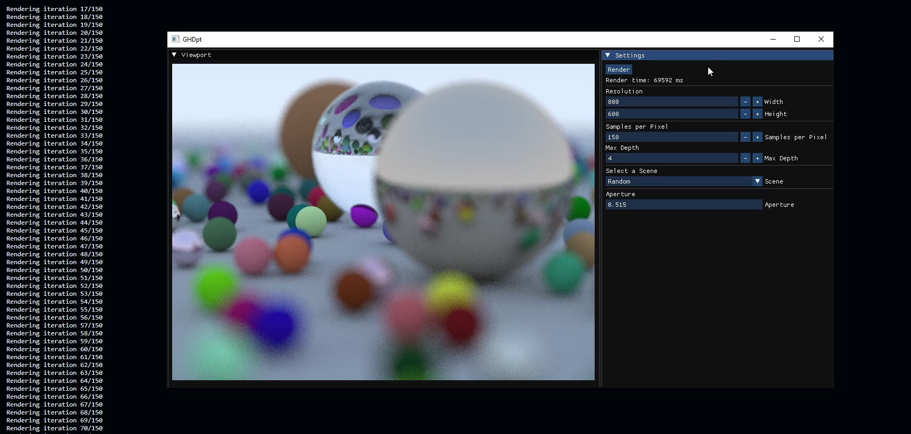

# GHDpt-cpp

This is a C++ implementation of the [Ray Tracing in One Weekend](https://raytracing.github.io/books/RayTracingInOneWeekend.html) book by Peter Shirley.

I added a GUI to the project to make it easier to experiment with the code. The code is multithreaded and uses a progressive rendering technique to give faster feedbacks.

https://github.com/user-attachments/assets/44b6bdcc-63d9-4cf3-af8a-a9080d5258cc

You can watch a video of the project in action [here](https://youtu.be/ZWx8FC_pkAI).

## Credits

- [Ray Tracing in One Weekend](https://raytracing.github.io/books/RayTracingInOneWeekend.html) by Peter Shirley

## License

By Gholamreza Dar 2024
